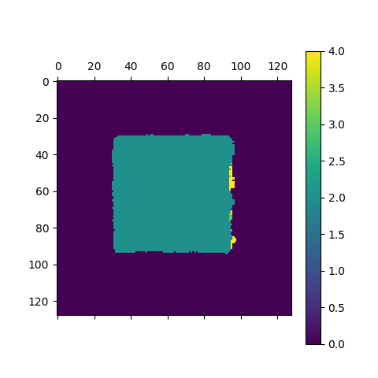
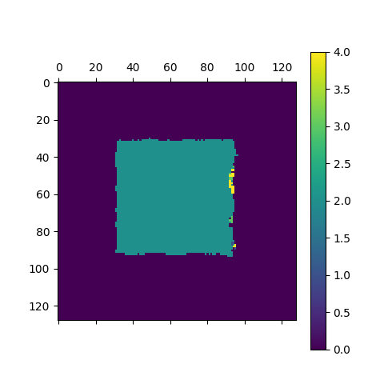
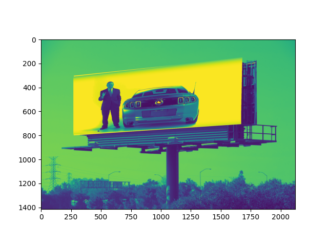

# Stereo Matching and Homography (DLT)

This project implements classical **computer vision algorithms** for depth estimation and perspective transformation.

The project includes:

- **Stereo Matching** for depth estimation from a pair of images  
- **Homography estimation using DLT** for perspective transformation and image warping  

---

## Technologies

`Python` `NumPy` `OpenCV` `SciPy` `Matplotlib`

---

## Algorithms

### Stereo Matching

Depth is estimated by computing the **disparity** between a left and right stereo image.

Two similarity measures are implemented:

- **SSD — Sum of Squared Differences**

$$
SSD(L,R) = \sum_i (L_i - R_i)^2
$$


- **Normalized Cross Correlation**

These methods produce a **disparity map** representing the depth of objects in the scene.

---

### Homography Estimation (DLT)

A homography matrix is estimated from corresponding points between two images using the **Direct Linear Transform (DLT)** algorithm.

The matrix is then used to **warp one image into the perspective of another**.

---

## Example Results

### SSD Disparity


### Normalized Correlation Disparity


### Homography Warping (DLT)


---

## Run the Project

Install dependencies:

```bash
pip install numpy opencv-python scipy matplotlib
```

Run the program:

```bash
python ex4_main.py
```
----

###### Ariel University, Israel || Semester B, 2021
